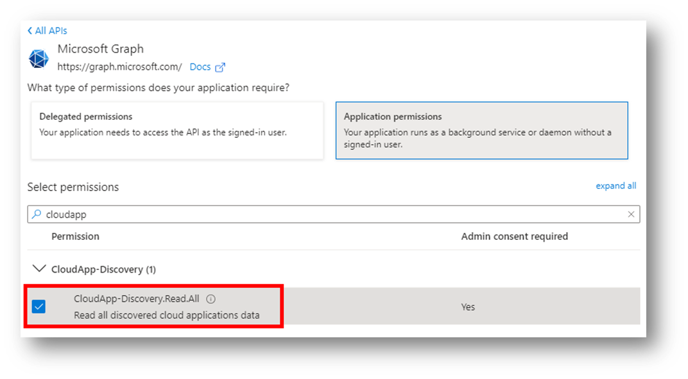
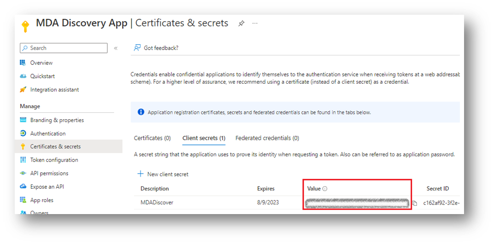

# Discovered Apps API via Microsoft Graph

### Contacts
| Name | Role          |
| --------------- | -- |
| Itai Cohen      | PM |
| Douglas Santos  | PM |
| Keith Fleming   | PM |


## Background:
This API will allow customers to GET all the data available in Discovered Apps page via an API; including filters, ‘select’ (https://learn.microsoft.com/en-us/graph/query-parameters?tabs=http#odata-system-query-options) and more. 

## Basic Features Functionality:
1.	Run the following GET command to get an high-level summary of the Discovery streams enabled on your tenant: 
https://graph.microsoft.com/beta/security/dataDiscovery/cloudAppDiscovery/uploadedStreams
  
  
2. Copy the relevant 'streamId': 
  
    

3.	Run the following GET command using the 'streamId':
  
  ```HTML 
  GET https://graph.microsoft.com/beta/security/dataDiscovery/cloudAppDiscovery/uploadedStreams/<streamId>/aggregatedAppsDetails(period=duration'P90D')
  ```
  
### Permissions Requirements: 
| Permissions	| Type	| Entities/APIs Covered |
| --- | --- | --- |
| CloudApp-Discovery.Read.All	| Read Discovered Apps data.	| Allows the app to read all available data pertaining to Discovered Cloud Apps from Microsoft Defender for Cloud Apps.|
  
## Top Use Cases and Examples
### See all the apps discovered this week: 

#### Code or REST operation example:
```HTML 
GET  https://graph.microsoft.com/beta/security/dataDiscovery/cloudAppDiscovery/uploadedStreams/<streamId>/aggregatedAppsDetails (period=duration 'P7D') 
```

Expected response:
```JSON
Response:{
  "value": [
    {
      "@odata.type": "#microsoft.security.DiscoveredCloudAppDetail",
      "id": 13203423542,
      "displayName": "Microsoft Exchange Online",
      "riskScore": 10,
      "totalNetworkTrafficInBytes": 243453345,
      "uploadNetworkTrafficInBytes": 934564,
      "downloadNetworkTraficInBytes": 242518781,
      "transactionCount": 52,
      "userCount": 49,
      "ipAddressCount": 33,
      "lastSeenDateTime": "2022-08-14",
      "tags": ["Sanctioned"],
      "category": "Marketing",
      "domains": ["*.outlook.office.com", "*.outlook.office365.com", "*.mail.onmicrosoft.com", "*.o365weve.com",...]      
    },
    { "id": 845938765493, "displayName": "Dropbox", "riskScore": 9 }
  ]
}
```
#### Using $select, and $filter see only the app name of all the apps discovered in the last 30 days with risk score lower or equal to 4:
```HTML 
GET https://graph.microsoft.com/beta/security/dataDiscovery/cloudAppDiscovery/uploadedStreams/<streamId>/aggregatedAppsDetails (period=duration'P30D')?$filter=riskRating  le 4 &$select=displayName Response:
```

Expected response:
```JSON
  Response:{
    "value": [
      {"displayName": "ShareASale"},
      {"displayName": "PubNub"}
    ]
}
```
#### Get the userIdentifier of all users (or devices or IPaddresses) using a specific app

```HTML 
GET  https://graph.microsoft.com/beta/security/dataDiscovery/cloudAppDiscovery/uploadedStreams/<streamId>/aggregatedAppsDetails (period=duration'P30D')/ <id>/users 
```

Expected response:

```JSON
Response:{
  "value": [
    { "userIdentifier": "Broderick@fabrikan.com"}, {" userIdentifier": "temp@fabrikan.com"}
  ]
}
```
*same for a collection of entities called Collection(discoveredCloudAppsipAddress) with 1 property called "ipAddress"

*same for a collection of entities called Collection(discoveredCloudAppsDevice) with 1 property called "name". Note applicable only if the stream is Endpoint Stream.

#### Using filters, see all apps which are categorized as Marketing and are not Hippa or GDPR compliant
*Note if Defender for Endpoint stream is used, "deviceCount" will be presented as well

```HTML
GET  https://graph.microsoft.com/beta/security/dataDiscovery/cloudAppDiscovery/uploadedStreams/<endpointStreamId>/aggregatedAppsDetails (period=duration 'P30D')?$filter= (appInfo/Hippa eq 'false' or appInfo/GDPR eq 'false') and category eq 'Marketing' 
```

Expected response:

```JSON
Response:
{
  "value": [
    {
      "@odata.type": "#microsoft.security.endpointDiscoveredCloudAppDetail",
      "id": 13203423542,
      "displayName": "Microsoft Exchange Online",
      "riskScore": 10,
      "totalNetworkTrafficInBytes": 243453345,
      "uploadNetworkTrafficInBytes": 934564,
      "downloadNetworkTraficInBytes": 242518781,
      "transactionCount": 52,
      "userCount": 49,
      "deviceCount": 37,
      "ipAddressCount": 33,
      "lastSeenDateTime": "2022-08-14",
      "tags": ["Sanctioned"],
      "category": "Marketing",
      "domains": ["*.outlook.office.com", "*.outlook.office365.com", "*.mail.onmicrosoft.com", "*.o365weve.com",...]      

    },
    { "id": 845938765493, "displayName": "Dropbox", "riskScore": 9 }
  ]
}
```

# Using Graph API
## Best practices of how to use Graph API
### Here are the steps to register an Azure AD app with these permissions, if you want to test this with a script such as PowerShell:

### 1. Create an App using either [Application Context](https://learn.microsoft.com/en-us/defender-cloud-apps/api-authentication-application) or [User Context](https://learn.microsoft.com/en-us/defender-cloud-apps/api-authentication-user) and give it consent.
In general, you’ll need to take the following steps to use the APIs:
 
* Create an Azure Active Directory (Azure AD) application
* Get an access token using this application
* Use the token to access the Defender for Cloud Apps API

Steps (1 to 3): To create an App in Azure AD, follow the steps 1, 2 and 3 on this documentation
https://learn.microsoft.com/en-us/defender-cloud-apps/api-authentication-application#create-an-app
 
When you get to step 4 on, use the instructions below instead of the steps in the public doc.
You will need to customize the permissions needed for managing Cloud Discovery
 
### 2. Under Microsoft Graph, give permission to the CloudApp-Discovery.Read.All 



### 3. Grant Admin Consent to the App


### 4. Get an app secret under "Certificates & Secrets" and copy the string under “value” to be used by your script later on
Note: You can also use certificates
 
  
### 5. Now you configure your script/code to use the authorized App to query the API.
Here is a sample code in Powershell:

[Placeholder]

## Integrate your response with PBI
[Placeholder]


# Details and schema changes
@itaig-msft please add the details of the schema changes here, it looks like there has been some updates to PR.

## New entity types
###  *DiscoveredCloudAppDetail*  
| Property        | Type           | Description  |
| ------------- |:-------------:| -----:|
| id      | String | The unique identifier for the discovered cloud app. |
| displayName	| String	| The name of the app (no restriction) |
| tags	| List of Strings	| A list of all the tags of an app. Usually it ranges between 0 to 2 but theoretically can have up to 15 custom tags| 
|riskScore|Int|The risk score of the app: 10 means secure, 1 means very risky|
|uploadNetworkTraficInBytes|Int32|The amount of upload traffic in bytes|
|downloadNetworkTraficInBytes|Int32|The amount of download traffic in bytes|
|transactionCount|Int|number of the transactions; a transaction is one log line of usage between two devices. i.e, any request to the SaaS app is a transaction, so if the user browse the app and then clicked on a link inside the app it is counted as 2 transactions|
|userCount|Int|the number of all the users who browsed this app|
|ipAddressCount|Int|The number of IP Addresses that were browsed to this app|
|lastSeenDateTime|Date|When was the app last browsed. format YYYY-MM-DD|
|domains|List of Strings|A list of all domains/URLs associated to this app. List length can be any number between 1 to 55.|
|category|appCategory|This field describes what category an app is in. An app can be part of a single category only. Categories examples: Marketing, Social Media, Collaboration.|


###  *Relationships* 
| Property        | Type           | Description  |
| ------------- |:-------------:| -----:|
| users | Collection(discoveredCloudAppsUser) | the email of the user|
| ipAddresses | Collection(discoveredCloudAppsipAddress) | the discovered IP address|
| appInfo | discoveredCloudAppsAppInfo | the 90 parameters which determine the risk score of the app|

###  *Supported functionality* 
|Operation | Supported | Method | Success | Notes |
| ------------- |:-------------:| -----:| -----:| -----:|
|List | Yes | `GET` | 200 OK | |
|Get | Yes | `GET` | 200 OK | |


###  *Supported query patterns* 
| Pattern        | Supported  |  Syntax | Notes  |
| ------------- |:-------------:| -----:| -----:|
|Server-side pagination| Yes | `@odata.nextLink` | |
| Filter 1 - equals | Yes | `/collection?$filter=propA eq 'value'` | propA can be: id, displayName, tags, riskScore, traffic, transactionCount, userCount, ipAddressCount, lastSeenDateTime, domains, and all appInfo parameters*, with value1 according to property type.|
| Filter 2 - not equals | Yes | `/collection?$filter=propA ne 'value'` | propA can be: id, displayName, tags, riskScore, traffic, transactionCount, userCount, ipAddressCount, lastSeenDateTime, domains, and all appInfo parameters*, with value1 according to property type.|
| Filter 3 - in range | Yes | `/collection?$filter=propA le 'value1' and propA ge 'value2''` |propA can be: riskScore, traffic, uploadNetworkTraficInBytes, downloadNetworkTraficInBytes, transactionCount, userCount, ipAddressCount, lastSeenDateTime, and all appInfo parameters* of type int or date, , with value1 and value2 as int, date or float according to property.|
| Filter 4 - less than or equal | Yes | `/collection?$filter=propA le 'value'` | propA can be: riskScore, traffic, uploadNetworkTraficInBytes, downloadNetworkTraficInBytes, transactionCount, userCount, ipAddressCount, lastSeenDateTime, and all appInfo parameters* of type int or date, with value1 as int or float according to property. propA can be: lastSeen with value1 as date.|
| Filter 5 - greater than or equal | Yes | `/collection?$filter=propA ge 'value'` | propA can be: riskScore, traffic, uploadNetworkTraficInBytes, downloadNetworkTraficInBytes, transactionCount, userCount, ipAddressCount, lastSeenDateTime, and all appInfo parameters* of type int or date, with value1 as int or float according to property. propA can be: lastSeen with value1 as date.|
| Filter 6 - starts with | Yes | `/collection?$filter=startswith(propA, 'value')` | propA can be: displayName, tags, domains, appInfo/* all strings parameters |
| Filter 7 - end with | Yes | `/collection?$filter=endswith(propA, 'value')` | propA can be: displayName, tags, domains, appInfo/* all strings parameters |
| Filter 8 - contains text | Yes | `/collection?$filter=contains(propA, 'value')` | propA can be: displayName, tags, domains, appInfo/* all strings parameters |
| expand user property | Yes | `/collection?$expand=users` | |

###  *Sus*


